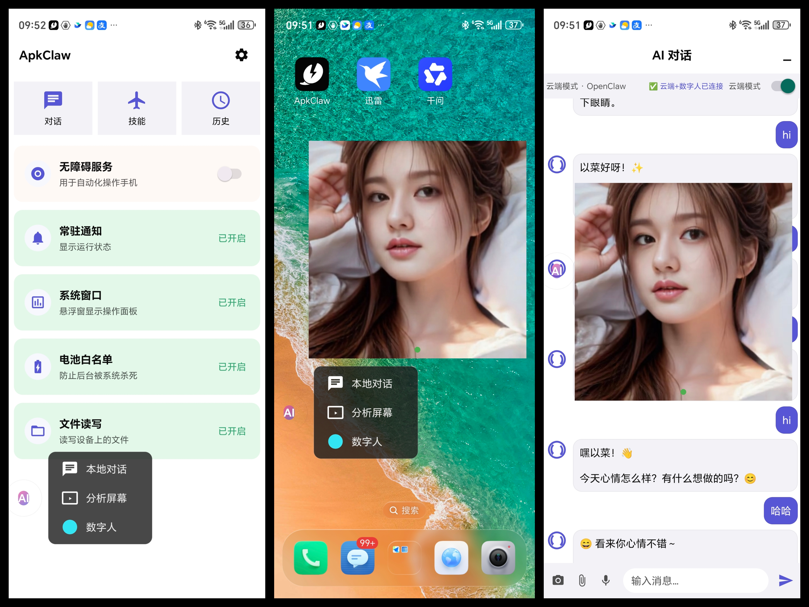
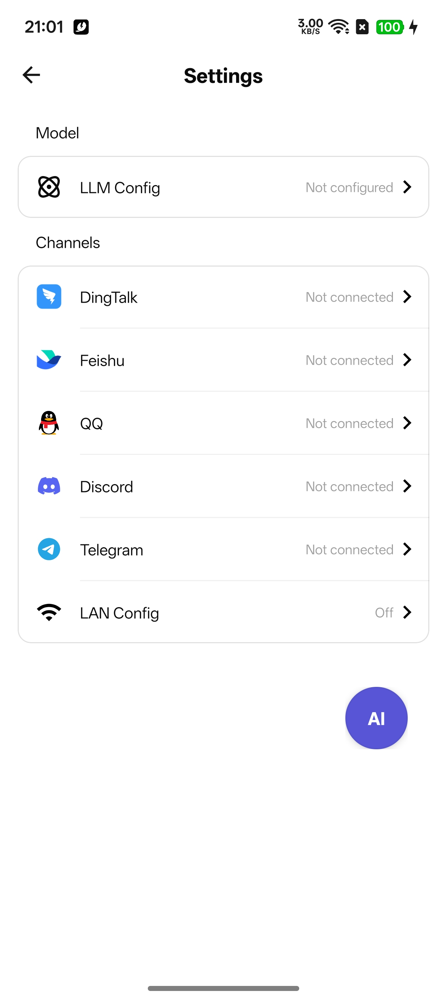
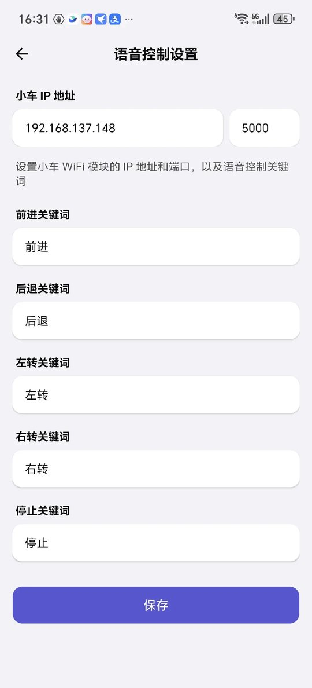
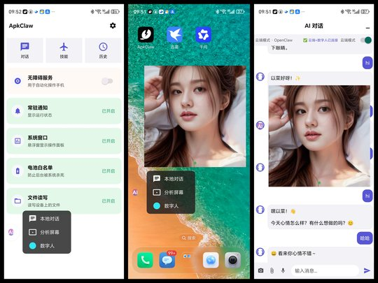

# ApkClaw

[English](README.md)

AI 驱动的 Android 自动化应用，通过自然语言让 LLM Agent 操控 Android 设备（手机）。用户通过消息渠道（钉钉、飞书、QQ、Discord、Telegram）发送指令，AI Agent 理解意图后自主执行设备操作。

## 截图

<p align="center">
  
  
  
  
</p>

## 架构概览

```
┌───────────────────────────────────────────────────────────────┐
│                      消息渠道                                  │
│   钉钉  │  飞书  │  QQ  │  Discord  │  Telegram  │  微信        │
└──────────────────────┬────────────────────────────────────────┘
                       │ 收到消息
                       ▼
              ┌─────────────────┐
              │  ChannelManager  │  消息路由与分发
              └────────┬────────┘
                       │
              ┌────────▼────────┐
              │ TaskOrchestrator │  任务锁、生命周期管理
              └────────┬────────┘
                       │
              ┌────────▼────────┐
              │  AgentService    │  Agent 循环
              │                  │
              │  ┌────────────┐  │
              │  │  LLM 调用  │◄─┼── LangChain4j (OpenAI / Anthropic)
              │  └─────┬──────┘  │
              │        │         │
              │  ┌─────▼──────┐  │
              │  │  工具执行   │◄─┼── ToolRegistry → ClawAccessibilityService
              │  └─────┬──────┘  │
              │        │         │
              │    循环直到       │
              │    任务完成       │
              └────────┬────────┘
                       │
                       ▼
              通过渠道回复用户
```

## Star History


## 核心执行流程

1. **用户**通过任意已连接的渠道发送自然语言消息
2. **ChannelSetup** 校验无障碍服务是否已开启
3. **TaskOrchestrator** 获取任务锁（单任务模型），按 Home 键重置设备状态
4. **DefaultAgentService** 进入 Agent 循环：
   - 构建系统提示词，注入设备上下文（品牌、型号、分辨率、已注册工具）
   - 调用 LLM 并传入工具定义（通过 LangChain4j 桥接层）
   - 从 LLM 响应中提取工具调用
   - 通过 **ToolRegistry** → **ClawAccessibilityService** 执行工具
   - 将工具执行结果反馈给 LLM
   - 循环直到调用 `finish` 工具或达到最大迭代次数（40 轮）
5. **结果**通过同一渠道回复给用户

## Agent 系统

### Agent 循环 (`DefaultAgentService`)

Agent 遵循 **观察 → 思考 → 行动 → 验证** 协议：

- **系统提示词**：注入设备信息（品牌、型号、Android 版本、屏幕分辨率）、已注册工具列表和安全约束
- **LLM 调用重试**：最多 3 次尝试，指数退避（1s → 2s → 4s），遇到 401/403 时不重试
- **死循环检测**：维护 4 轮滑动窗口 `(screenHash, toolCall)` 指纹，若全部相同则注入系统消息强制 Agent 换一种方式
- **Token 优化**：将历史 `get_screen_info` 结果替换为占位符以节省 token，仅保留最近一次
- **系统弹窗处理**：当 `getRootInActiveWindow()` 返回 null（检测到受保护的系统弹窗）时，截图发送给用户并终止任务

### 视觉感知 (Vision)

Agent 支持**自动视觉感知**功能，让 LLM 能够"看到"设备屏幕：

- **自动截图注入**：在观察类工具（`get_screen_info`、`take_screenshot`、`scroll_to_find`、`find_node_info`）执行成功后，自动截取屏幕并注入 LLM 请求
- **图片格式**：截图以 JPEG 格式（最大宽度 720px，质量 75%）转换为 Base64，通过 OpenAI API 兼容的 `image_url` 格式传递：
  ```json
  {
    "type": "image_url",
    "image_url": {
      "url": "data:image/jpeg;base64,{base64_image}"
    }
  }
  ```
- **历史截图优化**：全局只保留最新一张截图，历史截图会被清理以节省 token
- **适用模型**：支持视觉能力的模型如 `gpt-4o`、`gpt-4-vision-preview`、`claude-3-5-sonnet` 等

### LLM 集成

通过 `LlmClientFactory` 实现可插拔的 LLM 后端：

| 提供商 | 客户端类 | 模型构建器 |
|--------|---------|-----------|
| OpenAI 兼容 | `OpenAiLlmClient` | `OpenAiChatModel` / `OpenAiStreamingChatModel` |
| Anthropic | `AnthropicLlmClient` | `AnthropicChatModel` / `AnthropicStreamingChatModel` |

均支持流式和非流式模式。HTTP 层使用自定义的 `OkHttpClientBuilderAdapter`（基于 OkHttp）替代 JDK HttpClient 以兼容 Android。

**配置项** (`AgentConfig`)：
- `apiKey`：来自本地设置
- `baseUrl`：LLM 端点（默认：`https://api.openai.com/v1`）
- `modelName`：用户可选
- `provider`：`OPENAI`（默认）或 `ANTHROPIC`
- `temperature`：0.1（确定性输出）
- `maxIterations`：40
- `streaming`：可配置（默认关闭）

### LangChain4j 桥接层

`LangChain4jToolBridge` 将自定义的 `BaseTool` 抽象转换为 LangChain4j 的 `ToolSpecification` 格式，将参数类型（`string`、`integer`、`number`、`boolean`）映射为 JSON Schema。

## 工具系统

工具按设备类型在 `ToolRegistry` 中注册：

### 通用工具（所有设备）
| 工具 | 说明 |
|------|------|
| `get_screen_info` | 获取 UI 层级树，供 AI 分析当前界面 |
| `find_node_info` | 通过文本或资源 ID 查找元素 |
| `take_screenshot` | 截取当前屏幕为 PNG |
| `input_text` | 向焦点输入框输入文本 |
| `open_app` | 通过名称打开应用 |
| `get_installed_apps` | 获取已安装应用列表 |
| `press_back` / `press_home` | 返回 / 回到桌面 |
| `open_recent_apps` | 打开最近任务 |
| `expand_notifications` / `collapse_notifications` | 展开 / 收起通知栏 |
| `lock_screen` | 锁屏 |
| `wait` | 等待指定时长 |
| `repeat_actions` | 重复执行一组操作 |
| `send_file` | 通过渠道发送文件给用户 |
| `finish` | 完成任务并返回总结 |

### 手机专属工具
| 工具 | 说明 |
|------|------|
| `tap` | 点击指定坐标 (x, y) |
| `long_press` | 长按指定坐标 |
| `swipe` | 从 A 点滑动到 B 点 |
| `click_by_text` | 通过可见文字点击元素 |
| `click_by_id` | 通过资源 ID 点击元素 |
| `search_app_in_store` | 在应用商店中搜索应用 |

每个工具继承 `BaseTool`，实现 `execute(Map<String, Any>): ToolResult`，提供中英文双语描述和类型化参数声明。

## 渠道系统

| 渠道 | 协议 | 所需凭证 |
|------|------|----------|
| 钉钉 | App Stream Client | Client ID + Client Secret |
| 飞书 | OAPI SDK | App ID + App Secret |
| QQ | QQ Bot API | App ID + App Secret |
| Discord | Gateway WebSocket + REST | Bot Token |
| Telegram | Bot HTTP API | Bot Token |

渠道凭证可通过应用内设置页或局域网 HTTP 服务器（`http://<设备IP>:9527`）配置。

## 云端对话模式

除了消息渠道，ApkClaw 还支持内置的**云端对话**模式，通过 WebSocket 与后端服务器通信。该模式支持在应用内聊天界面进行实时双向消息交互。

### 功能特性

- **实时 WebSocket 通信**：与云端服务器保持持久长连接，实现低延迟消息交换
- **服务端主动推送**：服务器可随时主动推送消息（`type=push`），消息会直接显示在聊天界面中
- **系统通知栏提醒**：推送消息会触发系统通知，采用 `IMPORTANCE_HIGH` 优先级，支持 `BigTextStyle` 长文本展示、振动提醒，点击通知可直接打开 `ChatActivity` 并显示推送内容
- **指数退避自动重连**：WebSocket 连接断开后，客户端自动尝试重连，采用指数退避策略 — 从 2 秒开始，每次翻倍（2s → 4s → 8s → 16s → 32s → 60s），最大延迟 60 秒，最多重试 10 次
- **通知权限自动处理**：在 Android 13+（API 33+）上，开启云端对话模式时自动检测并请求 `POST_NOTIFICATIONS` 权限，确保推送通知开箱即用
- **推送 Intent 透传**：点击推送通知时，完整消息内容通过 `EXTRA_PUSH_TEXT` 传递至 `ChatActivity`，显示在聊天列表并保存至历史记录

### 消息协议

消息通过 WebSocket 以 JSON 格式交换：

```json
// 客户端 → 服务器（用户发送消息）
{
  "type": "text",
  "session_id": "android_1746590000000",
  "text": "你好，请帮我查一下天气"
}

// 服务器 → 客户端（对话回复）
{
  "type": "text",
  "text": "今天北京天气晴，气温 25°C"
}

// 服务器 → 客户端（服务端主动推送）
{
  "type": "push",
  "text": "你有新的任务分配..."
}

// 服务器 → 客户端（错误）
{
  "type": "error",
  "message": "会话未找到"
}
```

### 配置方式

云端对话可在 设置 > 云端对话配置 中进行设置：
- **WebSocket 地址**：云端服务器的 WebSocket 端点 URL
- **会话 ID**：未指定时自动生成（格式：`android_<时间戳>`）

## 小车控制

ApkClaw 内置智能小车控制模块，通过 WiFi 直连小车，支持**摇杆操控**和**语音控制**两种交互方式。

<p align="center">
  
  
</p>

### 功能特性

- **双摇杆控制**：左摇杆控制前进/后退，右摇杆控制左转/右转，横屏沉浸式操作
- **阈值触发机制**：摇杆推到顶（≥95%）才发送方向指令，回中（≤5%）自动发送停止，中间过程不发请求，避免频繁无效指令
- **3D 停止按钮**：中间立体停止按钮，一键紧急停车
- **语音控制**：长按语音按钮开始录音，松开自动识别，支持拼音模糊匹配语音指令（前进、后退、左转、右转、停止）
- **TTS 语音播报**：每次执行指令后语音反馈当前状态（"已前进"、"已停止"等）
- **自动回中**：语音指令执行后 2 秒自动回中停止，防止小车持续运动
- **自定义关键词**：支持在设置中自定义各方向的语音唤醒词
- **双 STT 引擎**：支持 Android 系统语音识别（离线可用）和 HTTP API 语音识别（Whisper），可在设置中切换
- **蜂窝网络回退**：使用 HTTP STT 时，如果小车 WiFi 无互联网，自动切换到蜂窝网络发送识别请求
- **连接状态监控**：每 3 秒 Ping 小车，实时显示连接状态
- **调试日志面板**：显示 VAD 状态、识别中间结果、拼音匹配得分等调试信息

### 语音控制交互

采用 **Push-to-Talk（按住说话）** 模式：

1. **长按** 语音按钮 → 开始录音（按钮变红）
2. **说话** → 对着麦克风说出指令（如"前进"、"左转"）
3. **松开** → 自动停止录音并发送识别
4. 识别结果通过拼音模糊匹配，自动执行对应方向指令

语音识别采用增强型 VAD 算法：
- 环境噪声自动校准（前 600ms 采样）
- EMA 滚动平均平滑（α=0.3）
- 语音优先检测（必须先检测到语音才允许后续静音触发停止）
- 最短语音保护（300ms）

### 通信协议

小车通过 HTTP GET 指令控制：

```
GET http://{小车IP}:{端口}/control/{方向}_{速度}
```

| 方向 | 指令 | 说明 |
|------|------|------|
| 前进 | `forw` | 向前行驶 |
| 后退 | `back` | 向后行驶 |
| 左转 | `left` | 原地左转 |
| 右转 | `right` | 原地右转 |
| 停止 | `stop` | 立即停止 |

### 配置方式

在 设置 > 小车控制 中配置：
- **小车 IP 地址**：小车所在的局域网 IP
- **通信端口**：HTTP 控制端口
- **STT 模式**：本地识别（系统 SpeechRecognizer）或远程识别（HTTP API）
- **语音关键词**：自定义前进、后退、左转、右转、停止的唤醒词

## 无障碍服务

`ClawAccessibilityService`（Java）是设备交互的核心层：
- **手势操作**：通过 `dispatchGesture()` 实现点击、滑动、长按
- **节点遍历**：通过 `getRootInActiveWindow()` 获取 UI 层级树
- **按键注入**：通过 `performGlobalAction()` 实现 Home、返回、最近任务
- **截屏**：`takeScreenshot()`（需 Android 11+）

**已知限制**：系统保护窗口（如 `com.android.permissioncontroller` 的权限弹窗）会同时阻止节点树读取和手势注入（`filterTouchesWhenObscured` 机制）。Agent 检测到此情况后会截图通知用户手动处理。

## 局域网配置服务器

基于 NanoHTTPD 的 HTTP 服务器运行在端口 9527，方便通过 PC 浏览器配置设备：

| 端点 | 方法 | 用途 |
|------|------|------|
| `/` | GET | 配置页面 |
| `/api/channels` | GET/POST | 读取/更新渠道凭证 |
| `/api/llm` | GET/POST | 读取/更新 LLM 配置 |

通过 GET 获取时，敏感信息会做脱敏处理（仅显示末尾 4 位字符）。Debug 构建额外提供 `/debug.html` 工具调试控制台。

## 项目结构

```
app/src/main/java/com/apk/claw/android/
├── agent/                  # Agent 循环、配置、回调
│   ├── langchain/          # LangChain4j 桥接层 & OkHttp 适配器
│   └── llm/                # LLM 客户端 (OpenAI, Anthropic)
├── base/                   # BaseActivity（屏幕密度适配）
├── channel/                # 消息渠道处理器
│   ├── dingtalk/
│   ├── feishu/
│   ├── qqbot/
│   ├── discord/
│   └── telegram/
├── floating/               # 悬浮球 UI 管理
├── server/                 # 局域网配置 & 调试 HTTP 服务器
├── service/                # 无障碍服务、前台服务、保活服务
├── tool/                   # 工具抽象层 & 注册中心
│   └── impl/               # 工具实现 (通用/手机/电视)
├── ui/                     # Activity（启动页、首页、引导页、设置）
├── utils/                  # KVUtils, XLog, 格式化工具
└── widget/                 # 自定义 UI 组件
```

## 构建与运行

### 环境要求

- Java 17+
- Android Studio（建议 Ladybug 或更高版本）
- Android SDK 36（编译/目标），最低 SDK 28

### 编译

```bash
# 克隆仓库
git clone https://github.com/apkclaw-team/ApkClaw.git
cd ApkClaw

# Debug 构建
./gradlew assembleDebug

# Release 构建
./gradlew assembleRelease
```

### 配置与使用

1. **安装** APK 到 Android 设备（Android 9+）
2. **授权** — 在首页依次开启所有必要权限（无障碍服务、通知权限、悬浮窗、电池白名单、文件访问）
3. **配置 LLM** — 进入 设置 > LLM Config，填写：
   - **API Key**：你的 OpenAI 或 Anthropic API Key
   - **Base URL**：LLM 接口地址（默认 `https://api.openai.com/v1`，使用第三方服务商请修改）
   - **Model Name**：例如 `gpt-4o`、`claude-sonnet-4-20250514`
4. **配置渠道** — 进入设置，选择至少一个消息渠道（钉钉 / 飞书 / QQ / Discord / Telegram），填写机器人凭证
5. **发送消息** — 通过已配置的渠道发送消息，即可开始控制设备

> **提示**：你也可以通过局域网在 PC 浏览器上配置。在设置中开启 LAN Config，然后在 PC 上访问 `http://<设备IP>:9527`。

## 主要依赖

**AI / Agent**

| 依赖 | 版本 | 用途 |
|------|------|------|
| [LangChain4j](https://github.com/langchain4j/langchain4j) | 1.12.2 | Agent 编排、工具定义、LLM 集成 |

**消息渠道**

| 依赖 | 版本 | 用途 |
|------|------|------|
| [DingTalk Stream Client](https://github.com/open-dingtalk/dingtalk-stream-sdk-java) | 1.3.12 | 钉钉渠道 |
| [Feishu OAPI SDK](https://github.com/larksuite/oapi-sdk-java) | 2.5.3 | 飞书渠道 |

**网络**

| 依赖 | 版本 | 用途 |
|------|------|------|
| [OkHttp](https://github.com/square/okhttp) | 4.12.0 | HTTP 客户端（LLM 调用） |
| [Retrofit](https://github.com/square/retrofit) | 2.11.0 | REST API 客户端 |
| [NanoHTTPD](https://github.com/NanoHttpd/nanohttpd) | 2.3.1 | 局域网配置 & 调试 HTTP 服务器 |

**存储 & 工具**

| 依赖 | 版本 | 用途 |
|------|------|------|
| [MMKV](https://github.com/Tencent/MMKV) | 2.3.0 | 高性能本地键值存储 |
| [Gson](https://github.com/google/gson) | 2.13.2 | JSON 序列化 |
| [ZXing](https://github.com/zxing/zxing) | 3.5.3 | 二维码生成 |
| [UtilCode](https://github.com/Blankj/AndroidUtilCode) | 1.31.1 | Android 工具函数库 |

**UI**

| 依赖 | 版本 | 用途 |
|------|------|------|
| [Glide](https://github.com/bumptech/glide) | 5.0.5 | 图片加载 |
| [EasyFloat](https://github.com/princekin-f/EasyFloat) | 2.0.4 | 悬浮窗 |
| [MultiType](https://github.com/drakeet/MultiType) | 4.3.0 | RecyclerView 多类型适配器 |

## License

```
Copyright 2026 ApkClaw

Licensed under the Apache License, Version 2.0 (the "License");
you may not use this file except in compliance with the License.
You may obtain a copy of the License at

    http://www.apache.org/licenses/LICENSE-2.0

Unless required by applicable law or agreed to in writing, software
distributed under the License is distributed on an "AS IS" BASIS,
WITHOUT WARRANTIES OR CONDITIONS OF ANY KIND, either express or implied.
See the License for the specific language governing permissions and
limitations under the License.
```
